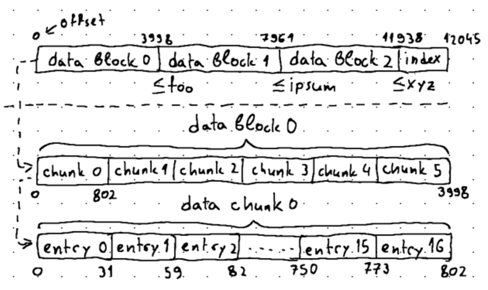

## Incremental Encoding
- This is possible due to sorted kv-pairs. e.g prefix key = `accusantiumducimus` and shared prefix = `accustantium` 
  - This saves 44 bytes of data at the expense of the 5 bytes necessary for storing the sharedLen of each key-value pair, resulting in 39 bytes of data saved in total.
- As a data block may have 100s of kv-pairs, we define a `restart interval` (`chunk size`) i.e how many keys will be incrementally encoded before we record another full key.
  - So, `data block` -> `data chunk` -> `data entry` 
- We can keep track of the **offsets of our restart points** and put them at the end of our data block as a kind of `mini-index block`. 
  - This might act as an index of our data chunks and enable binary search inside each data block, further accelerating our search operations. 
  - Since incremental encoding allows us to save some space, we can afford to spare some of this space for storing the index.
- Now, our primary index block will a regular block with a chunkSize of 1. So, all keys are stored completely without any shared prefix.
- Both our index blocks and data blocks now contain indexed offsets. However, they have different meanings:
  - Inside an index block, the key of each index entry tells us that all keys <= than a specific key are located in a particular data block.
    - During binary search, we want to locate the right-most data block, where `searchKey` <= `largestDataBlockKey`.
    - `index.search(searchKey, moveUpWhenKeyGT)`
  - Inside a data block, each offset points to the very first key of a data chunk, and the very first key of a data chunk tells us that keys >= than this key are located in either this or one of the following data chunks
    - So, when performing binary search, we want to locate the left-most data chunk, where `firstKey` > `searchKey`, as the searchKey will reside somewhere in the immediately preceding data chunk.
    - `data.search(searchKey, moveUpWhenKeyGTE)`
- So, is is no longer necessary to perform a sequential search on the entire data block. Instead, we can binary search the indexed offsets within the data block, locate the desired data chunk, and then only sequentially search the chunk.

## Compression
- tradeoff b/w speed and size. Smaller the file, more the time take to decompress it. We'll use `snappy` for compression.
  - Always benchmark, file size vs search time. e.g In our case, we saw 30% file size reduction but also 20-30% increase in search time.
- Compression makes sense if you're storing large amounts of data. However, you're constantly decompressing data blocks from disk to load them in memory for searching, use `caching` to store the decompressed copies of frequently accessed data blocks in memory.
  - So, real-world storage engines use `buffer pools` to cache decompressed data blocks.

## Important Points: 
- 1 data block != 1 memtable. Their relation depends on the memtable size limit and flush threshold.
  - e.g memtable size limit < flush threshold -> 1 data block can have multiple memtable
  - Practically, it is better to think in terms of records (kv-pairs) as workload might have lot of small kv-pairs or few exceptionally large kv-pairs.
- In our case, sstable is ~8 KB. As they are not fixed size, we can't use binary search.
  - We can make them fixed size using padding. However, this will lead to disk space wastage across all SSTables. Also, our write perf is degraded in case of small data. We have to pad everywhere unnecessarily.
- Once the correct index block points to a data block, the actual search inside the data block can be done entirely in memory. Disk I/O becomes limited to loading the relevant blocks.
- The size of the SSTable or the data it contains becomes less critical because binary search operates logarithmically, so even **a very large SSTable can be searched almost as quickly as a small one, provided the indexing is efficient** (load index block in memory -> load relevant data block in memory) and the number of disk accesses is controlled.
- Even if the total amount of data stored in `.sst` is large, the number of disk seeks matters more than the size of the file itself, because once a block is read into memory, in-memory operations are much faster. In modern systems, `seek time` and `latency for disk access` are primary bottlenecks, not the amount of data.

## SSTable
- Do buffered I/O of 4KB to match OS page size and block size on disks.
- `storageManager` manages primary data folder of storage engine that contains all `.sst` files produced.
- `writer.go` converts a memtable to a `.sst` file.
- `.sst` Format
  - Approach: data block: keyLen (2B)|valLen (2B)|key (keyLen bytes)|opKind (1B)|val (valLen bytes)
    - We made assumption that all kv-pairs with their metadata will fit into 1KiB size buffer.
    - 1KiB buffer allows size of key & val > 255 bytes -> we used uint16 (2B) to store keyLen & valLen.
    - 2 issues -- 1. user can enter larger blobs and 2. majority kv-pairs are short in size, so their lengths can fit in type smaller than uint16.

  - Optimizaton-1: Varint Encoding [Ref](https://www.cloudcentric.dev/exploring-sstables/)
    - e.g 64-bit integers require 8 bytes. With varint encoding, we can encode 64-bit integers in 1-10 bytes. So, it saves space for smaller integers but might be less efficient for large integers (as 10 bytes in worst case).
    - Previously, we used 2B to store keyLen & valLen -> total 4B. For smaller integers, these can fit in 1B each -> total 2B or 50% savings.
    - To work with varints, swap out fixed 1KB buffer with bytes.Buffer that can be dynamically resized.

  - Optimizaton-2: Binary search using Index blocks (indexing structure for each file)
    - If we know -- 1. stating point of each kv-pair (data block) and 2. total kv-pairs in a `.sst` file, we can apply binary search and reduce search time from O(n) to O(log n).
    - We can glue this indexing structure to the end of `.sst` file.
    - For binary search, we'll load the entire `.sst` into memory to parse the index block. With that, we can find the offset of each individual data block to locate its key. Once we know each key, we can use binary search to move from block to block as necessary.
    - We're doing binary search on the index block but decide whether to drop left/right portion based on the key at that index.
    - Note: index blocks incur a significant storage overhead of 10-15%.
    - Interesting comparision of sequential vs binary search: [Ref](https://www.cloudcentric.dev/exploring-sstables/#benchmarking-binary-search)
      - When we are looking through small amounts of data (e.g., data fitting within a single 4 KiB block), sequential search may sometimes be faster.
      - When the amount of data read from disk becomes significantly larger, amortizing the cost of disk I/O operations, binary search is better.

  - Optimization-3: Have smaller index blocks + avoid loading entire `.sst` into memory.
    - Observation: Our filesystem works with a default size of 4096 bytes. Any data beyond 4KB will need > 1 block from disk -> > 1 disk IO. So, our data blocks are capped at 4096 bytes.
    - New terminology: `data block` can have multiple `data entry` (individual kv-pair)
    - In the index block, instead of having offset of each kv-pair (`data entry`), we can now have {starting offset of each `data block`, total length, largest key}.
    - So, we'll use binary search across `data blocks` using our `index block` but sequential search within each `data block`. With block size of 4096 bytes, search will still be O(logn).
    - For this, we'll load up only the index block into memory, and then use it to locate and load the specific data block in memory and perform sequential search.
    - This will allow us to search very big `*.sst` files with no more than 3 disk accesses.
      - 1 disk access to read the footer
      - another one to read the index block
        - load this index block into memory
      - third one to read the data block
        - load this data block into memory
    - Best and worst case for search.
      - Best: Looking up the first key in the 1st data block of the newest SSTable
      - Worst: Looking up the last key in the last data block of the oldest SSTable
      - We need to start with newest SSTable and go to oldest. So, no. of disk seeks if key found in nth SSTable = n*3.
    - The index block now only takes 1% of our `*.sst` files. 

## Memtable
- Most DBs use skiplists as underlying DS for memtable. Skiplist-based memtable provide good overall performance for both read/write operations regardless of whether sequential or random access patterns are used. [Ref](https://www.cloudcentric.dev/exploring-memtables/)
- Read-only memtables -conversion to `.sst`-> SSTables. We don't touch the mutable memtable.
  - Trigger condition: When a new record is added, check if size of all memtables (mutable + non-mutable) exceeds the configured threshold.
  - `.sst` files are sorted by keys in ascending order. So, we need to scan the first level of skiplist to get this.
- Deletion requires marking keys using `tombstones` because all memtables except the current one are read-only. So, we can't delete the key(s) from them.
  - For this, we use a byte called `OpKey` and append the value of our kv-pair to it.
      - encoded value = `OpKey` + value
      - `OpKey` = 0 (delete) and 1 (insert)

## Skiplist
- Skiplist is an ordered map (i.e it has ordered keys): [Ref](ttps://pkg.go.dev/github.com/huandu/skiplist#section-readme)
- It is a multi-leveled sorted linked list, where each level acts as an express lane to skip over a certain number of elements from the preceding levels. It is a lighter alternative to balanced BSTs.
- Key features:
  - On each level, nodes are sorted by keys.
  - All nodes in a skip list occupy its lowest level (level 0)
  - Each node has a "tower" with forward pointer(s) to the next node(s) on each corresponding level.
  - Probabilistic balancing of keys (using random no. generator)
  - Search/Insert/Delete operations 
    - Avg time: O(log n)
    - Worst case: O(n) when all elements have level = 1
- Why do we need it?
    - Although worst case time for balanced trees (AVL, self-balancing, etc) for Search/Insert/Delete is O(log n), they give poor perf. when input data is sorted due to constant rebalancing.
    - Skip lists have balance properties similar to that of search trees built by random insertions, yet do not require insertions to be random.
    - `MaxHeight` = `L(n)` = `log1/pn`
      - n = predicted max no. of elements that we expect to store.
      - p = fraction of nodes with level `i` pointers that also have level `i+1` pointers
- Search/Insert/Delete: [Ref](https://www.cloudcentric.dev/implementing-a-skip-list-in-go/)
  - During search, use `journey` array to keep track of immediate predecessor on each level. This helps with inserts/deletes. 
  - We have to randomly generate a height for every new node before inserting it into the list
  - level = [0, MaxHeight-1]; height = [1, MaxHeight]
  - Interesting how author has generated a probability distribution for the height of a node.