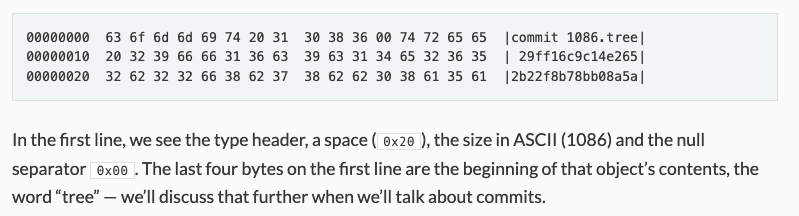
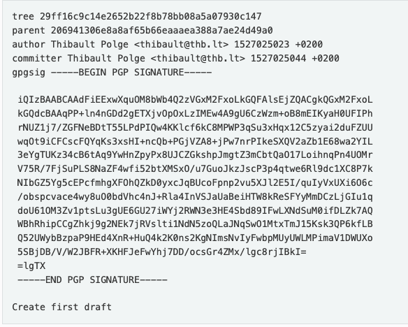

### Sub-commands
- `init`: `./wyag init [path]`
- `hash-object`: `./wyag hash-object [-w] [-t TYPE] FILE`
  - converts existing file into git object and store it (-w flag) or simply print the hash to stdout
  - low-level (plumbing) command
- `cat-file`: `./wyag cat-file [type] [object]`
  - prints git object to stdout
  - low-level (plumbing) command
- `log`: `./wyag log [commit] > log.dot`; `dot -O -Tpdf log.dot`
  - A much simpler version than what Git provides. We’ll dump Graphviz data and let the user use `dot` to render the actual log.
- `ls-tree`: `./wyag ls-tree [-r] TREE`
  - prints contents of a tree, recursively with `-r` flag

### Refereces
1. https://wyag.thb.lt/

### Concepts
- Git repository is an abstraction with 2 parts:
  - `work tree`: where files meant for version-control live
    - It is a regular directory
  - `git directory`: where git stores its own data
    - child directory of `work tree` called `.git`

- `.git` contains the following:
  - `.git/objects/`: object store
    - `.git/objects/pack/`: contains the packfile (`.pack`) and index file of same name with (`.idx`) extension
  - `.git/refs/`: reference store
    - `.git/refs/heads`
    - `.git/refs/tags`
  - `.git/HEAD`: reference to the current HEAD
  - `.git/config`: repo's config file
  - `.git/description`: descrption of repo's contents, for humans and is rarely used.

- config file contains the following:
  - `repositoryformatversion = 0`: the version of the gitdir format. 0 means the initial format, 1 the same with extensions. If > 1, git will panic; wyag will only accept 0.
  - `filemode = false`: disable tracking of file modes (permissions) changes in the work tree.
  - `bare = false`: if true, the repo is a bare repo, meaning that it does not have a working tree. . Git supports an optional worktree key which indicates the location of the worktree, if not ..; wyag doesn’t.

- Git is a “content-addressed filesystem” -- unlike regular filesystems (arbitrary filenames), filenames in Git are **mathematically derived from file's contents by using SHA-1 hash** If a single byte of, say, a text file, changes, its internal name will change. So, **you don’t modify a file in git, you create a new file in a different location.**
  - Regular filesystems are actually closer to a key-value store than Git is. Because it computes keys from data, Git could rather be called a `value-value store`.

- `Objects`: Files in the git repository, whose paths are determined by their contents.
  - **Almost everything in Git is an object**: actual files (source code), commits, tags, etc.
  - An object contains:
    - `header`: specifies one of the **4 types** (`blob`, `commit`, `tag` or `tree`)
    - This is folowed by ASCII space (0X20)
    - size of the object as an ASCII number
    - null separator (0X00)
    - contents of the object
  - The objects (headers and contents) are stored compressed with zlib.
  - `SHA-1 hash`: Git renders the hash as a lowercase hexadecimal string e.g `abcdef1234567890..` (length = 40 with 16 possible digits [a-f][0-9]), and splits it in two parts: , and the rest `cdef1234567890..`. 
    - directory name: the first two character `ab`
    - file name: the rest `cdef1234567890..`
    - This is because most filesystems hate having too many files in a single directory and would slow down to a crawl.
    - Git’s method creates 256 (16*16 for 1st 2 positions) possible intermediate directories.
    
  - generic `GitObject`: 3 methods -- `serialize()`, `deserialize()`, and `init()`

- `Blob`: simplest object type. The content of every file you put in git (main.c, logo.png, README.md) is stored as a blob.

- `Packfile`: Git has 2 storage mechanismas -- **loose objects** and **packfiles**.
  - packfiles are more efficient and complex than loose objects.
  - a packfile is a compilation of loose objects (like a tar) but some are stored as deltas (as a transformation of another object). 
  - we are not implementing them in wyag.

- `Commit`: It is an object that looks (uncompressed, without headers) like this: 
    - `tree`: object that contains actual content of the commit: file contents, and where they go. A tree maps blobs IDs to filesystem paths, and describes a state of the work tree.
    - `author` identity (name and email), and a timestamp;
    - `committer` identity (name and email), and a timestamp;
    - `parent`: reference to the parent commit. merge commits have multiple parents while very first commit has none.
    - `gpgsig`: PGP signature of the commit object -- committed by person who owns the GPG private key and ensure the contents aren't tampered.
    - `message`

- Why `OrderedDict` for commits and tags?
  - We want keys in sorted order so that fields always appear in same order.
  - Git has 2 rules for object identity:
    - **The same name will always refer to the same object**. This is because object name = hash of its contents.
    - **The same object will always be referred by the same name.** This is why key ordering is important. If the ordering changes, SHA-1 will change -> name will change.

- `Tree`: maps actual file contents of a commit to filesystem paths. It is an []{[file mode](https://en.wikipedia.org/wiki/File-system_permissions), SHA-1, path}
  - SHA-1 refers to either a blob or another tree object. If a blob, the path is a file, if a tree, it’s directory.
  
  - To instantiate this tree in the filesystem, we first load object related with `.gitignore` and then for `LICENSE` and `README.md`. These are all blobs so we create a file for them with the blob's contents.
  - The object associated with `src` is not a blob, but another tree: we’ll create the directory src and repeat the same operation in that directory with the new tree.
  - Unlike tags and commits, tree objects are **binary objects**. Their format:
  `[mode] space [path] 0x00 [sha-1]`
    - `[mode]`: 6 bytes and octal repr. of file mode, stored in ASCII. e.g 100644 is encoded as 49 (ASCII “1”), 48 (ASCII “0”), 48, 54, 52, 52. First 2 digits encode file type (file, directory, symlink or submodule), the last four the permissions.
    - 0X20 (ASCII space)
    - null-terminated 0X00 path
    - object's SHA-1 in binary encoding, on 20 bytes

- `checkout`: simply instantiates a commit in the worktree.
  - wyag's checkout will take two arguments: a commit, and a directory. Git checkout only needs a commit.
  - it will then instantiate the tree in the directory, if and only if the directory is empty.  

### Interesting tid-bits
- Git compresses everything using zlib
- It uses a configuration file format that is basically Microsoft’s INI format.